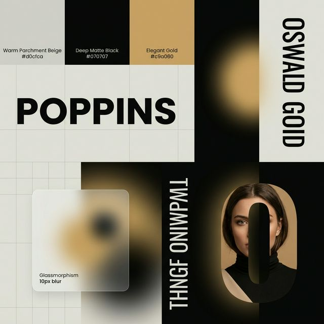

# Direction Artistique – Portfolio @nnoah29

Ce document définit l'identité visuelle et les standards graphiques du portfolio. Il sert de guide de référence pour maintenir une cohérence esthétique à travers tous les supports et composants.

## 1. Vision & Concept
L'univers visuel repose sur le contraste entre le **classique (Éditorial)** et le **numérique (Futuriste)**.
- **Impact Éditorial** : Utilisation de typographies massives et d'espaces blancs généreux, rappelant la mise en page des magazines de luxe.
- **Profondeur Organique** : Un fond chaud et texturé qui évite la froideur du blanc pur.
- **Dynamisme Lumineux** : Des halos et des lueurs qui apportent une dimension "vivante" et interactive.

---

## 2. Palette Chromatique
Le système de couleurs est restreint pour maximiser l'élégance et le luxe.

| Nom | Référence | Usage |
| :--- | :--- | :--- |
| **Parchemin Chaud** | `#d0cfca` | Couleur de fond principale, apporte douceur et texture. |
| **Noir Profond** | `#070707` | Typographie principale, bordures et zones de contraste maximal. |
| **Or Premium** | `#c9a060` | Accents, halos lumineux et séparateurs d'impact. |
| **Or Solaire** | `#d4af37` | Variante plus vive utilisée pour les sections secondaires (Sub-Hero). |

---

## 3. Système Typographique
La typographie est traitée comme un élément graphique à part entière.

- **Poppins (Sans-Serif)** :
  - **Identité** : Moderne, géométrique et accessible.
  - **Usage** : Corps de texte, boutons, et surtout **Titres Hero massifs**. Proportions imposantes (allant jusqu'à 11-12em) pour un effet "affiche".
- **Oswald (Verticale)** :
  - **Identité** : Serrée, haute et structurée.
  - **Usage** : Titres de sections secondaires, métadonnées, et éléments nécessitant une forte verticalité.

---

## 4. Formes & Éléments Distinctifs
Le design utilise des géométries spécifiques pour guider l'œil et marquer l'identité.

- **La Grille Infinie** :
  - Un motif de grille fine qui défile en arrière-plan. Elle symbolise la structure de l'ingénierie derrière le design.
- **Les Halos Ambiants (Glows)** :
  - Grandes taches de lumière dorée ou sombre avec un flou extrême (120px). Elles ne sont pas de simples décorations mais créent une ambiance lumineuse diffuse.
- **La Lettre-Portrait ("O")** :
  - Transformation d'un caractère typographique en fenêtre (masque) sur un portrait. Forme de pilier/rectangle arrondi très spécifique.
- **Bandeaux Inclinés** :
  - Alignements de textes défilant à des angles dynamiques (autour de 50°), créant un effet de ruban industriel ou de luxe.
- **Transparence & Glassmorphism** :
  - Utilisation de fonds noirs translucides avec un flou de surface (10px) pour les éléments flottants (ex: fenêtres de CV), permettant de deviner le fond sans perdre en lisibilité.

---

## 5. Interactions & Rythme
Même sans code, le rythme visuel est défini par :
- **Asymétrie contrôlée** : Les éléments sont souvent décalés les uns par rapport aux autres pour créer un dynamisme naturel.
- **Transition d'état** : Passage du mode "contour" (outline) au mode "plein" (solid) pour souligner l'interaction.
- **Parallaxe de profondeur** : Différentes couches de contenu se déplaçant à des vitesses variées pour simuler un espace physique en 3D.
